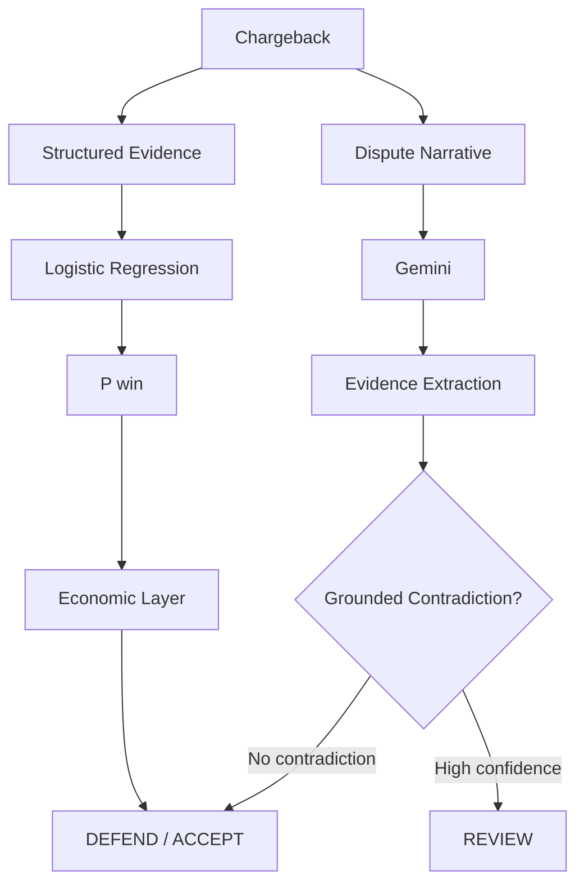

# Recourse

### AI-Assisted Chargeback Defense

Should a merchant spend resources defending this chargeback?

Recourse answers that question by combining a statistical risk model, economic reasoning, and LLM-powered evidence verification.

Every case ends in one of three actions:

**🟢 DEFEND** · **🔴 ACCEPT** · **🟡 REVIEW**

---

## The Idea

Chargeback decisions shouldn’t be based on a single prediction.

Recourse separates the problem into three layers:

| Layer | What it does |
| :--- | :--- |
| **Risk Model** | Estimates the probability of successfully defending the chargeback |
| **Economic Layer** | Determines whether defending is economically worthwhile |
| **Gemini Evidence Layer** | Interprets dispute narratives and detects grounded contradictions |

The LLM does not make the final decision.

---

## Architecture



**Why this separation?**

* Logistic Regression handles structured predictive risk.
* Economic logic converts probability into expected merchant value.
* Gemini handles free-form customer narratives.
* Grounding rules prevent unsupported LLM claims from changing the decision.
* Human review handles ambiguity and high-confidence contradictions.

---

## How a Decision Works

### 1. Predict
The Logistic Regression model estimates:

$$\text{P(win)} = \text{probability of successfully defending the chargeback}$$

Only observable transaction and merchant evidence is used.

### 2. Calculate
Recourse estimates:
* Expected recovery
* Defense cost
* Expected net value

$$\text{Expected recovery} = \text{P(win)} \times \text{transaction amount}$$
$$\text{Expected net value} = \text{Expected recovery} - \text{defense cost}$$

### 3. Verify
Gemini analyzes the customer’s dispute narrative and extracts:
* Customer claim
* Claim confidence
* Merchant-evidence contradiction
* Contradiction confidence
* Grounded contradiction detail
* New signal

### 4. Escalate when necessary
A high-confidence contradiction is not allowed to silently override the model.

Instead:

> **🟡 REVIEW** — human verification required

If Gemini fails, produces invalid output, or cannot ground its claim against merchant evidence, Recourse safely falls back to **REVIEW**.

---

## Decision Outcomes

* **🟢 DEFEND**  
  The structured model and economic layer indicate that defending the chargeback has sufficient expected value, with no high-confidence grounded contradiction requiring review.

* **🔴 ACCEPT**  
  The expected recovery does not justify the estimated defense cost.

* **🟡 REVIEW**  
  The case requires human attention, for example because:
  * The customer’s narrative directly contradicts merchant evidence with high confidence.
  * The predicted win probability falls into the configured review band.
  * LLM evidence extraction or validation fails.

REVIEW is a safety mechanism rather than treating every decision as a binary prediction.

---

## Example

**Customer says**
> “Tracking says delivered, but I never received the package.”

**Merchant evidence**
```json
{
  "delivered": true,
  "delivery_confirmed": true
}
```

**Gemini finds**
* Customer claim: `item_not_received`
* Contradiction: `true`
* Confidence: `0.95`

**Recourse decides**
> **🟡 REVIEW**

The underlying model prediction and economics remain visible:

| Metric | Value |
| :--- | :--- |
| P(win) | 51.4% |
| Expected recovery | ₹2,492 |
| Defense cost | ₹271 |
| Expected net | ₹2,221 |

The LLM supplies evidence, not an uncalibrated replacement probability.

---

## Why Use an LLM Separately?

We tested whether narrative-derived signals should simply be added to the predictive classifier.

A deterministic heuristic proxy for LLM-derived signals was evaluated using the same frozen train/validation/test methodology.
This was not a live-Gemini experiment.

The additional signals did not improve held-out classification performance.

Rather than forcing an LLM into the classifier, Recourse deliberately gives each component a focused responsibility:

* **Model predicts.**
* **Economics decides.**
* **Gemini interprets.**
* **Grounding safeguards.**
* **Humans review ambiguity.**

This keeps the system measurable and auditable while using an LLM where it provides a different capability.

---

## Evaluation

Recourse uses a frozen synthetic dataset of 600 chargebacks.

| Split | Cases |
| :--- | :--- |
| Training | 360 |
| Validation | 120 |
| Held-out test | 120 |

The split is fixed and stratified by chargeback outcome.

The held-out test set is not used for model or threshold selection.

### Held-out Results

| Strategy | Net Merchant Recovery |
| :--- | :--- |
| Always Accept | ₹0.00 |
| Rules baseline | ₹107,843.32 |
| Logistic Regression | ₹152,451.19 |
| Always Defend | ₹151,812.20 |
| Oracle | ₹164,654.43 |

### Logistic Regression — Held-Out Test

| Metric | Result |
| :--- | :--- |
| Precision | 54.8% |
| Recall | 98.4% |
| False-positive rate | 92.9% |
| Defend rate | 95.8% |
| Recovery | ₹178,876.88 |
| Defense cost | ₹26,425.69 |
| Net recovery | ₹152,451.19 |
| Foregone recovery | ₹525.37 |

> **Important limitation:** The current synthetic dataset produces a highly defense-heavy classifier. Its net recovery is only modestly above the always-defend baseline. We therefore do not claim that the predictive model is production-optimal.

The evaluation demonstrates a reproducible decision framework with explicit leakage controls, economic reasoning, evidence verification, and human-review escalation.

---

## Data Boundaries

Recourse explicitly separates observable evidence from hidden outcomes.

### Observable Evidence
* Transaction amount and age
* Payment method
* Account history
* Previous chargebacks/refunds
* Device familiarity
* Location consistency
* Transaction velocity
* Delivery confirmation
* Customer contact
* Merchant response time
* Refund request
* Dispute type
* Dispute narrative

### Hidden — Evaluation/Training Only
* Actual defensibility
* Actual win/loss outcome
* Actual recovery amount
* Defense cost
* Dataset split assignment

Hidden outcomes are:
* ❌ Never accepted by the public API
* ❌ Never sent to Gemini
* ❌ Never used during inference

---

## Supported Disputes

* `ITEM_NOT_RECEIVED`
* `UNAUTHORIZED_TRANSACTION`
* `PRODUCT_NOT_AS_DESCRIBED`

Gemini may return `other` when a narrative does not cleanly fit these categories.

---

## API

### Run Locally

```bash
python3 -m pip install -r requirements.txt
export GEMINI_API_KEY="your-key"
python3 -m uvicorn app.main:app --reload
```

Then open:
```text
http://localhost:8000/docs
```

### Endpoints

| Endpoint | Purpose |
| :--- | :--- |
| `GET /` | Service information |
| `GET /health` | Health check |
| `POST /decide` | Analyze a chargeback |
| `GET /docs` | Interactive API documentation |

The decision response includes:
* Final decision
* P(win)
* Expected recovery
* Defense cost
* Expected net value
* Gemini evidence
* Review reason
* Auditable reasoning

---

## Project Structure

```text
recourse/
├── app/
│   ├── main.py
│   ├── schemas.py
│   └── service.py
│
├── models/
│   ├── logistic_regression.py
│   ├── economic_decision.py
│   ├── llm_evidence.py
│   └── gemini_provider.py
│
├── evaluation/
│   ├── evaluate_model.py
│   ├── evaluate_economic_policy.py
│   ├── llm_ablation.py
│   ├── credibility.py
│   └── ...
│
├── data/
│   ├── chargebacks_observable.csv
│   ├── chargebacks_complete.csv
│   ├── split_assignments.csv
│   └── schema.md
│
├── tests/
├── requirements.txt
├── .gitignore
└── README.md
```

---

## Design Principles

AI should only be used where it adds value.

* **Predictive model** → structured risk
* **Economic layer** → expected merchant value
* **Gemini** → unstructured evidence
* **Grounding rules** → prevent unsupported claims
* **Human review** → handle ambiguity and contradiction

The goal is not to make Recourse maximally AI-heavy.

The goal is to make chargeback decisions measurable, economically useful, explainable, and safe to automate.
